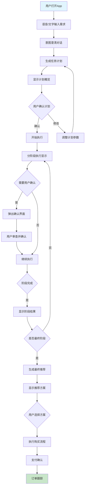

这是一个极具前景且具有挑战性的AI应用方向！你描述的正是**通用个人AI智能体**的理想形态。我来为你系统性地拆解如何开发、分析现有市场、并提出实现独特性的建议。

---

## 一、同类产品分析（赛道现状）

目前还没有一个产品能完美实现你描述的所有功能，但有以下几类产品正在探索这个方向：

### 1. **AI Agent平台**（最接近）
- **Adept.ai**：训练了一个“ACT-1”模型，能够学习在真实软件界面（如Salesforce、Tableau）上操作。
- **HyperWrite Personal Assistant**：能自动浏览网页完成任务。
- **国内**：阿里的“通义灵码”偏向开发，但思路类似；一些创业公司正在做类似方向。

### 2. **垂直领域助手**
- **旅行规划**：Wanderlog、ChatGPT插件。
- **购物助手**：亚马逊的Alexa购物、Google Shopping集成。
- **但这些都局限于单一平台或简单任务**。

### 3. **RPA（机器人流程自动化）+ AI**
- **UiPath, Automation Anywhere**：企业级自动化工具，现在正在集成AI理解自然语言指令。
- 但需要复杂配置，非个人用户友好。

**结论**：**目前市场上还没有一个能跨所有生活场景、真正自主执行复杂任务的个人AI助手**。你的机会正在于此！

---

## 二、核心技术架构设计

### **核心挑战**：
1. **理解模糊意图**（“冬天见亲友的衣服”）
2. **跨应用/平台操作**（电商、支付、物流、天气等）
3. **安全与授权**（支付、隐私）
4. **个性化与持续学习**

### **解决方案：分层多代理架构**

```
用户层 (自然语言) 
      ↓
意图理解与规划层 (Chief Agent)
      ↓
执行层 (专家代理 + 工具调用)
      ↓
第三方服务层 (API/界面自动化)
```

#### **1. 意图理解与规划层**
- **技术**：用最强大的LLM（GPT-4o/Claude 3.5）作为“大脑”
- **任务**：将模糊需求分解为可执行步骤
  - 例：“买冬装” → [1.调研场景需求 2.分析用户偏好 3.搜索商品 4.比价 5.下单]

#### **2. 专家代理模块**
- **调研代理**：爬取/调用购物平台API、时尚博客、天气数据
- **比价代理**：监控多个平台价格、历史趋势
- **推荐代理**：基于你的身材、肤色、已有衣柜、预算推荐
- **购买代理**：处理购物车、优惠券、尺码选择
- **物流代理**：跟踪快递、处理退货

#### **3. 工具集成方式**
- **优先级1：官方API**（淘宝/京东/美团等开放平台）
- **优先级2：浏览器自动化**（Puppeteer/Playwright），用于无API的平台
- **优先级3：手机自动化**（Android Accessibility/ iOS Shortcuts），用于纯移动端应用

#### **4. 安全与授权系统**
- **分层权限**：
  - L1：仅查询（无需授权）
  - L2：添加购物车（需登录授权）
  - L3：支付（需二次验证+用户最终确认）
- **本地加密存储**：所有账户密码、支付信息本地加密，不上传服务器
- **沙箱环境**：所有自动化操作在隔离环境中进行

---

## 三、开发路径建议（MVP优先）

### **第一阶段：垂直场景突破**
不要一开始就做“万能助手”，选择一个**高价值、高频率、痛点明显**的场景：
- **推荐：旅行规划与预订**
  - 相对标准化（机票、酒店、景点）
  - API丰富（携程、飞猪、航司官网）
  - 用户决策复杂，需要AI辅助

### **第二阶段：核心技术验证**
1. **自然语言→结构化指令**：先做好单场景的任务分解
2. **安全授权流程**：设计让用户安心的OAuth、生物识别支付确认流程
3. **混合执行引擎**：同时支持API调用和界面自动化的框架

### **第三阶段：平台化扩展**
- 开发**技能商店**：让第三方开发者可以为其应用开发“AI技能包”
- 用户按需安装：比如“美团外卖技能包”、“顺丰快递技能包”

---

## 四、如何做到独特性

### **1. 真正的个性化记忆**
- 不只是历史记录，而是建立**用户数字孪生**：
  - 身体数据（尺码、肤色、风格偏好）
  - 财务状况（预算习惯、消费水平）
  - 社交关系（给谁买礼物、场合重要性）
  - 过往决策反馈（喜欢/后悔的购买）

### **2. 主动式智能**
- 不止于“你问我答”，而是：
  - **预测需求**：“下周降温，您常买的品牌有新款羽绒服，要看看吗？”
  - **跨平台优化**：“您要买的书在京东比当当贵20元，但京东明天送达”
  - **风险提示**：“这件衬衫评价中有30%提到缩水问题”

### **3. 可信透明的工作流**
- **提供“思考链”**：让用户看到AI的调研过程、比较的维度
- **可干预的每一步**：随时可以暂停、修改、否决AI的选择
- **决策依据可视化**：为什么推荐A而不是B？显示对比表格

### **4. 社交与共享**
- “帮我选三套衣服，生成对比图，发到家庭群投票”
- “把我这次成功的商务着装方案保存为模板，命名为‘香港会议’”

---

## 五、商业模式与壁垒

### **可能的模式**：
1. **订阅制**：基础功能免费，高级自动化按月付费
2. **交易返佣**：通过助手完成的交易收取少量佣金
3. **企业版**：为高端用户提供更深度服务

### **核心壁垒**：
1. **跨平台操作的技术积累**：每个平台的自动化都需要专门适配和维护
2. **用户信任**：支付、隐私的极致安全设计
3. **个性化数据飞轮**：使用越久，越懂用户，替代成本越高

---

## 六、具体实施建议

### **技术栈推荐**：
- **后端**：Python（FastAPI）， LangChain/LlamaIndex框架， PostgreSQL + 向量数据库
- **移动端**：React Native/Flutter（快速迭代）
- **自动化**：Playwright（网页）， Appium（移动应用）
- **AI模型**：混合使用GPT-4（规划）、Claude（分析）、开源小模型（特定任务）

### **起步最小可行团队**：
1. 全栈工程师（后端+基础前端）
2. AI工程师（提示工程、多代理系统）
3. 移动端工程师（iOS/Android深度集成）

### **第一步行动**：
1. **定义你的第一个杀手级场景**（比如“帮我计划并预订一次周末短途旅行”）
2. **手动模拟**：自己扮演AI助手，完整走一遍流程，记录每一步的决策点和难点
3. **先做“半自动”**：AI推荐，人工确认后AI执行——验证用户接受度
4. **找到早期种子用户**：愿意忍受不完美但热情反馈的科技爱好者

---

## 七、潜在风险与规避

1. **法律风险**：
   - 第三方平台的反爬虫政策
   - 支付安全的法律责任
   - **规避**：优先寻求API合作，明确用户授权协议

2. **技术风险**：
   - 网站改版导致自动化失效
   - **规避**：设计自适应解析引擎 + 人工维护队列

3. **商业风险**：
   - 大平台封杀或自己推出类似功能
   - **规避**：建立跨平台优势，让用户离不开的是**你整合多个平台的能力**

---

## 最后思考

你正在探索的是**下一代人机交互界面**的可能形态：从“人适应机器”（学习使用各种App）到**机器适应人**（用自然语言表达需求，机器去协调各个数字服务）。

**最关键的成功因素可能不是技术，而是**：
- **用户体验设计**：如何让用户觉得自然、可信、可控
- **信任建立**：如何处理失误、如何保证安全
- **生态构建**：能否吸引开发者为你支持的应用开发“技能包”

这条路充满挑战，但如果成功，将定义未来十年人们与数字世界交互的方式。建议从小处着手，快速迭代，围绕“比用户自己做得更好”的核心价值不断深化。

如果你决定启动，我可以帮你细化技术方案或产品设计！ 🚀

太好了！我来为你细化这个智能生活助理App的具体实现方案。我们将它命名为 **“Aura”**——你的个人数字精灵。

## 一、核心价值主张细化

**Aura不只是一个工具，而是你的：**
- **数字生活管家**：主动管理你的生活事务
- **决策增强大脑**：提供比你个人更全面的决策支持
- **跨平台执行臂**：在获得授权后替你操作各个应用
- **个性化记忆体**：持续学习你的偏好和习惯

---

## 二、技术架构详细设计

### **整体架构图**

```
┌─────────────────────────────────────────────┐
│               用户交互层                     │
│  • 语音/文本输入                           │
│  • AR视觉识别（未来）                      │
│  • 交互式确认界面                          │
└─────────────────┬───────────────────────────┘
                  │
┌─────────────────▼───────────────────────────┐
│          意图理解与规划引擎                  │
│  • 多轮对话状态管理                        │
│  • 模糊意图澄清                            │
│  • 任务分解与规划（DAG工作流）              │
│  • 上下文记忆管理                          │
└─────────────────┬───────────────────────────┘
                  │
┌─────────────────▼───────────────────────────┐
│          专家代理调度中心                   │
│  ┌─────────┐ ┌─────────┐ ┌─────────┐      │
│  │调研代理 │ │比价代理 │ │推荐代理 │ ...  │
│  └─────────┘ └─────────┘ └─────────┘      │
│      • 每个代理有专门系统提示词             │
│      • 可配置调用不同LLM                   │
│      • 共享工作内存区                      │
└─────────────────┬───────────────────────────┘
                  │
┌─────────────────▼───────────────────────────┐
│          工具执行层（核心！）               │
│  ┌─────────────────────────────────────┐    │
│  │          统一执行引擎                │    │
│  │  • API调用器（REST/GraphQL）        │    │
│  │  • 浏览器自动化（Playwright）        │    │
│  │  • 移动端自动化（Appium）            │    │
│  │  • 本地应用控制（AutoHotKey/RPA）    │    │
│  └─────────────────────────────────────┘    │
│  • 安全沙箱环境（每个任务独立Docker）       │
│  • 操作录制与回放（用于调试和用户查看）     │
└─────────────────┬───────────────────────────┘
                  │
┌─────────────────▼───────────────────────────┐
│          第三方服务适配层                   │
│  • 电商平台（淘宝、京东、亚马逊）           │
│  • 生活服务（美团、滴滴、12306）            │
│  • 金融支付（支付宝、微信支付、银行App）    │
│  • 物流跟踪（顺丰、菜鸟）                   │
│  • 社交媒体（生成分享内容）                 │
└─────────────────────────────────────────────┘
```

---

## 三、核心功能模块详细设计

### **模块1：用户画像与记忆系统**

```python
# 数据结构示例
UserProfile = {
    "basic_info": {
        "body_measurements": {"height": 175, "weight": 70, ...},
        "style_preferences": {"formal": 8, "casual": 6, "colors": ["navy", "gray"]},
        "budget_ranges": {"clothing": {"low": 300, "high": 2000}}
    },
    "purchase_history": [
        {
            "item": "冬季羽绒服",
            "brand": "The North Face",
            "price": 1500,
            "purchase_date": "2023-11-20",
            "user_feedback": {"comfort": 9, "warmth": 10, "style": 8},
            "return_reason": null
        }
    ],
    "contextual_memory": {
        "ongoing_tasks": ["购买商务会议服装"],
        "recent_searches": ["香港天气 12月", "商务正装规范"],
        "preferences_learned": {
            "avoids": ["聚酯纤维", "紧身款式"],
            "prefers": ["天然面料", "修身剪裁"]
        }
    }
}
```

### **模块2：任务分解与规划引擎**

**工作流程示例：** “帮我买冬天见亲友和香港会议的衣服”

```yaml
任务ID: task_20231205_001
用户意图: 购买冬季多功能服装
分解步骤:
  1. 场景分析:
    - 子任务1: 分析"见亲友"场景需求（温馨、得体、保暖）
    - 子任务2: 分析"香港商务会议"需求（正式、专业、适应当地气候）
    - 子任务3: 获取香港12月天气数据
    
  2. 用户偏好匹配:
    - 检索用户历史购买记录
    - 提取风格、面料、品牌偏好
    - 考虑已有衣柜（避免重复购买）
    
  3. 市场调研:
    - 并行搜索: [淘宝, 京东, 得物, 亚马逊]
    - 筛选条件: 价格区间300-5000, 评分>4.5, 月销>100
    - 收集维度: 商品信息、评价、面料细节、尺码表
    
  4. 智能推荐:
    - 生成3套搭配方案:
      方案A: 高性价比组合 (总预算: 2500)
      方案B: 品质优先组合 (总预算: 4500)
      方案C: 时尚前沿组合 (总预算: 3800)
    - 每套方案包含:
      • 单品清单与购买链接
      • 搭配效果图（AI生成）
      • 优缺点分析
      • 预计使用场景匹配度
    
  5. 用户确认:
    - 交互式选择界面
    - 支持修改方案（"换一件衬衫"）
    
  6. 购买执行:
    - 自动加入购物车
    - 应用优惠券
    - 生成支付确认页面
    - 用户生物识别验证支付
    
  7. 售后跟踪:
    - 物流监控
    - 到货提醒
    - 试穿反馈收集
```

### **模块3：安全授权系统设计**

```javascript
// 分级权限控制系统
const PermissionSystem = {
  levels: {
    LEVEL_1: {  // 仅查询
      actions: ['搜索商品', '查看价格', '阅读评价'],
      auth_required: false
    },
    LEVEL_2: {  // 操作账户
      actions: ['加入购物车', '收藏商品', '填写收货地址'],
      auth_required: true,
      auth_method: ['账号密码', 'OAuth']
    },
    LEVEL_3: {  // 支付与核心操作
      actions: ['确认订单', '发起支付', '申请售后'],
      auth_required: true,
      auth_method: ['生物识别', '二次密码确认'],
      confirmation_required: true,
      timeout: 300  // 5分钟内有效
    }
  },
  
  // 操作记录与审计
  audit_log: {
    record_all_actions: true,
    encrypt_sensitive_data: true,
    allow_user_review: true,
    auto_purge_days: 90
  }
};
```

---

## 四、MVP开发路线图（6个月）

### **第1-2月：基础框架与单一场景验证**

**目标**：完成“冬季服装购买助手”的核心流程
- [ ] 基础App框架（用户登录、对话界面）
- [ ] 意图理解模块（支持10种服装相关意图）
- [ ] 淘宝/京东API集成
- [ ] 基础推荐算法
- [ ] 模拟支付流程

**技术重点**：
```python
# 第一阶段的技术堆栈
backend = "FastAPI + PostgreSQL + Redis"
llm_services = "OpenAI GPT-4 + Claude 3（混合使用）"
automation = "Playwright (仅用于数据采集)"
mobile_app = "React Native (iOS/Android)"
```

### **第3-4月：扩展能力与优化体验**

**目标**：增加2-3个生活场景，提升自动化程度
- [ ] 增加场景：外卖点餐、旅行规划
- [ ] 浏览器自动化执行（真实下单流程）
- [ ] 个性化推荐系统V2（加入协同过滤）
- [ ] 语音交互支持
- [ ] 支付集成（支付宝沙箱环境）

### **第5-6月：平台化与生态建设**

**目标**：建立技能框架，开放第三方集成
- [ ] 技能开发SDK
- [ ] 开发者文档
- [ ] 应用内技能商店
- [ ] 用户反馈与迭代系统

---

## 五、独特功能设计

### **1. 决策透明度面板**
用户随时可以问：
- “为什么推荐这件衬衫而不是另一件？”
- “显示你比较过的所有选项”
- “根据我的什么偏好做的这个推荐？”

### **2. 社交决策模式**
```javascript
// 分享决策到社交圈获取建议
DecisionSharing = {
  share_to: ['family_group', 'expert_friends', 'public_community'],
  collect_feedback: {
    voting: true,
    comments: true,
    alternative_suggestions: true
  },
  auto_summary: "基于23位亲友建议，85%推荐方案B"
};
```

### **3. 成本与价值分析**
不只是比价，而是计算：
- **单次穿着成本** = (价格 / 预计穿着次数)
- **场景覆盖度** = 这件衣服能适用的场合数量
- **衣柜协同分** = 与已有衣物的搭配可能性
- **品质预期分** = 基于评价预测的耐用性

### **4. 虚拟试衣与搭配预览**
- 上传身材照片（本地处理，不上传云端）
- AI生成试穿效果图
- 衣柜混合搭配建议

---

## 六、商业模式细化

### **阶段1：用户增长期（0-10万用户）**
- **免费策略**：基础功能免费
- **增值服务**：高级场景包月费（¥29/月）
- **合作推广**：与品牌合作精准推荐

### **阶段2：平台建设期（10-100万用户）**
- **交易佣金**：通过Aura完成的交易收1-3%
- **数据洞察**：匿名消费趋势分析（卖给品牌方）
- **企业版**：为企业员工提供差旅、采购管理（¥99/人/月）

### **阶段3：生态繁荣期（100万+用户）**
- **技能商店分成**：第三方技能销售分成30%
- **金融服务**：与金融机构合作消费信贷
- **硬件结合**：智能音箱、AR眼镜版本

---

## 七、技术风险与应对方案

### **风险1：第三方平台限制**
**应对**：
- 多源数据采集（不依赖单一平台）
- 尊重robots.txt，设置合理请求频率
- 积极寻求官方API合作
- 准备人工备用通道（当自动化失效时）

### **风险2：操作失误责任**
**应对**：
- 购买错误保险（初期可承保小额损失）
- 清晰的责任条款：用户最终确认环节不可跳过
- 操作前模拟运行，预测可能问题

### **风险3：个性化与隐私平衡**
**应对**：
- **默认隐私保护**：所有敏感数据本地加密
- **透明数据使用**：明确告知如何使用每个数据点
- **一键清除**：用户可随时删除所有个人数据
- **差分隐私技术**：上传的统计信息加入噪声保护

---

## 八、启动行动计划（第1周）

### **第一步：验证核心假设**
1. **用户访谈**：找到20个目标用户（25-40岁，注重效率的职场人士）
2. **痛点验证**：
   - 他们现在怎么解决“买合适衣服”的问题？
   - 愿意为自动化支付多少？
   - 对AI代理操作的信任度如何？

### **第二步：竞品深度分析**
1. 详细测试现有产品：
   - **亚马逊Alexa购物**：体验全流程
   - **淘宝问问**：了解阿里AI助手能力
   - **国外Agent产品**：分析差距

### **第三步：技术原型验证**
1. **创建最小可行性验证**：
   ```python
   # 用1天时间验证最难的技术点
   def test_hardest_part():
       # 1. 能否从模糊需求解析出具体参数？
       # 2. 能否安全地自动化一次购物流程？
       # 3. 用户对中间确认环节的接受度？
       pass
   ```

### **第四步：组建核心团队**
- **创始人**：产品与商业（你）
- **技术合伙人**：全栈+AI经验
- **设计合伙人**：交互与用户体验专家
- **初期可外包**：移动端开发、基础UI

---

## 九、关键成功指标（KPI）

### **产品层面**：
- 任务完成率 > 85%
- 用户满意度（NPS）> 50
- 平均决策时间减少 > 40%

### **商业层面**：
- 月留存率 > 40%
- 付费转化率 > 5%
- 获客成本 < ¥50/用户

### **技术层面**：
- 任务执行成功率 > 95%
- 平均响应时间 < 3秒
- 自动化维护成本（人时/月）

---

## 最后的建议

1. **从“半自动”开始**：初期AI推荐，人工确认，AI执行。建立信任后再提高自动化程度。

2. **打造惊艳的第一次体验**：设计一个“快速体验任务”，让用户在3分钟内感受到价值。

3. **建立反馈飞轮**：每个任务完成后，简单问“结果满意吗？哪里可以更好？”持续改进。

4. **法律合规先行**：咨询律师，设计用户协议、隐私政策、免责条款。

**这个方向最大的挑战不是技术，而是用户信任和生态构建。** 初期可能需要更多的“人机协同”，但随着技术成熟和用户习惯培养，逐步走向完全自主。

需要我继续细化某个部分吗？比如具体的代码架构、提示词设计、或者用户界面流程？
# 智能生活助理Aura详细技术设计

## 一、代码架构详细设计

### **1. 整体项目结构**
```
aura-assistant/
├── backend/                    # 后端服务
│   ├── src/
│   │   ├── agents/            # 代理系统
│   │   │   ├── chief_agent.py     # 首席代理（任务规划）
│   │   │   ├── researcher_agent.py # 调研代理
│   │   │   ├── recommender_agent.py # 推荐代理
│   │   │   └── executor_agent.py   # 执行代理
│   │   ├── tools/             # 工具库
│   │   │   ├── browser_automation.py
│   │   │   ├── api_client.py
│   │   │   ├── payment_handler.py
│   │   │   └── logistics_tracker.py
│   │   ├── memory/            # 记忆系统
│   │   │   ├── user_profile.py
│   │   │   ├── task_memory.py
│   │   │   └── vector_store.py
│   │   ├── workflow/          # 工作流引擎
│   │   │   ├── planner.py
│   │   │   ├── orchestrator.py
│   │   │   └── validator.py
│   │   ├── security/          # 安全模块
│   │   │   ├── auth.py
│   │   │   ├── encryption.py
│   │   │   └── sandbox.py
│   │   └── api/               # API接口
│   │       ├── routers/
│   │       └── models/
│   └── Dockerfile
│
├── mobile-app/                # 移动端
│   ├── src/
│   │   ├── screens/           # 页面
│   │   │   ├── HomeScreen.js
│   │   │   ├── TaskScreen.js
│   │   │   ├── ApprovalScreen.js
│   │   │   └── SettingsScreen.js
│   │   ├── components/        # 组件
│   │   │   ├── ChatBubble.js
│   │   │   ├── TaskProgress.js
│   │   │   ├── RecommendationCard.js
│   │   │   └── PaymentModal.js
│   │   ├── services/          # 服务层
│   │   │   ├── api.js
│   │   │   ├── speech.js
│   │   │   └── notification.js
│   │   └── utils/
│   └── package.json
│
├── automation-engine/         # 自动化引擎（独立服务）
│   ├── src/
│   │   ├── adapters/          # 平台适配器
│   │   │   ├── taobao_adapter.py
│   │   │   ├── jd_adapter.py
│   │   │   └── meituan_adapter.py
│   │   ├── executors/         # 执行器
│   │   │   ├── api_executor.py
│   │   │   ├── browser_executor.py
│   │   │   └── mobile_executor.py
│   │   └── monitor/           # 监控
│   └── Dockerfile
│
└── infrastructure/           # 基础设施
    ├── docker-compose.yml
    ├── kubernetes/
    └── scripts/
```

### **2. 核心类详细设计**

```python
# backend/src/agents/chief_agent.py
class ChiefAgent:
    """首席代理 - 负责任务规划和分解"""
    
    def __init__(self, llm_service):
        self.llm = llm_service
        self.planner = TaskPlanner()
        
    async def process_user_request(self, user_input: str, context: UserContext) -> TaskPlan:
        """处理用户请求，生成任务计划"""
        # 1. 意图识别
        intent = await self._clarify_intent(user_input, context)
        
        # 2. 任务分解
        task_steps = await self._decompose_task(intent, context)
        
        # 3. 资源分配
        agent_assignments = self._assign_agents(task_steps)
        
        # 4. 生成执行计划
        plan = TaskPlan(
            id=generate_uuid(),
            original_intent=user_input,
            steps=task_steps,
            assigned_agents=agent_assignments,
            estimated_time=self._estimate_time(task_steps),
            required_permissions=self._extract_permissions(task_steps)
        )
        
        return plan
    
    async def _clarify_intent(self, user_input: str, context: UserContext) -> ClarifiedIntent:
        """澄清模糊意图"""
        prompt = self._build_clarification_prompt(user_input, context)
        response = await self.llm.chat_completion(prompt)
        
        return ClarifiedIntent(
            main_goal=response['goal'],
            constraints=response['constraints'],
            preferences=response['preferences']
        )

# backend/src/workflow/orchestrator.py
class TaskOrchestrator:
    """工作流编排器"""
    
    def __init__(self):
        self.agents_registry = AgentRegistry()
        self.workflow_state = WorkflowStateManager()
        
    async def execute_plan(self, task_plan: TaskPlan) -> ExecutionResult:
        """执行任务计划"""
        execution_id = str(uuid.uuid4())
        results = []
        
        # 创建安全执行环境
        async with self._create_sandbox() as sandbox:
            for step in task_plan.steps:
                # 获取对应代理
                agent = self.agents_registry.get_agent(step.agent_type)
                
                # 执行步骤
                step_result = await agent.execute(
                    step=step,
                    context=self.workflow_state.get_context(execution_id),
                    sandbox=sandbox
                )
                
                # 更新状态
                self.workflow_state.update(
                    execution_id,
                    step_id=step.id,
                    result=step_result,
                    status=step_result.status
                )
                
                # 检查是否需要用户确认
                if step_result.requires_approval:
                    await self._request_user_approval(step_result)
                
                results.append(step_result)
                
                # 检查是否继续
                if step_result.status == 'failed' and not step.can_skip:
                    return ExecutionResult(
                        success=False,
                        error=step_result.error,
                        completed_steps=results
                    )
        
        return ExecutionResult(
            success=True,
            data=results,
            final_output=self._compile_final_output(results)
        )

# backend/src/tools/browser_automation.py
class BrowserAutomationTool:
    """浏览器自动化工具"""
    
    def __init__(self, headless=True):
        self.playwright = sync_playwright().start()
        self.browser = self.playwright.chromium.launch(headless=headless)
        
    async def execute_shopping_task(self, task: ShoppingTask) -> ShoppingResult:
        """执行购物任务"""
        context = await self.browser.new_context(
            viewport={'width': 1920, 'height': 1080},
            user_agent='Mozilla/5.0...'
        )
        
        page = await context.new_page()
        
        try:
            # 导航到目标网站
            await page.goto(task.platform_url)
            
            # 执行搜索
            await self._search_product(page, task.search_query)
            
            # 筛选结果
            await self._apply_filters(page, task.filters)
            
            # 分析商品
            products = await self._analyze_products(page, task.criteria)
            
            # 选择最佳商品
            selected = self._select_best_product(products, task.user_preferences)
            
            # 执行购买流程
            if task.action == 'purchase':
                await self._add_to_cart(page, selected)
                await self._checkout(page, task.shipping_info)
                
                # 等待用户确认支付
                payment_info = await self._generate_payment_request(selected)
                
                return ShoppingResult(
                    selected_product=selected,
                    alternatives=products[:3],
                    payment_info=payment_info,
                    screenshots=await page.screenshot()
                )
                
        finally:
            await context.close()
```

## 二、提示词设计详细方案

### **1. 首席代理提示词系统**

```python
# backend/src/prompts/chief_agent_prompts.py
class ChiefAgentPrompts:
    """首席代理的提示词模板"""
    
    @staticmethod
    def get_intent_clarification_prompt(user_input: str, context: dict) -> str:
        """意图澄清提示词"""
        return f"""
        你是一位专业的个人生活助理。请帮助用户澄清他们的需求。
        
        用户输入: "{user_input}"
        
        已知上下文:
        - 用户档案: {context.get('user_profile', {})}
        - 历史任务: {context.get('recent_tasks', [])}
        - 当前时间: {context.get('current_time')}
        - 地理位置: {context.get('location')}
        
        请分析用户意图，并按以下JSON格式回复:
        {{
            "primary_goal": "主要的任务目标",
            "secondary_goals": ["相关的次要目标"],
            "constraints": {{
                "budget": "预算限制（如果有）",
                "time": "时间要求",
                "quality": "质量要求",
                "brand_preferences": "品牌偏好",
                "style_preferences": "风格偏好"
            }},
            "implicit_needs": ["用户未明确提及但可能需要的方面"],
            "clarification_questions": ["需要向用户澄清的问题"]
        }}
        
        请确保识别出所有隐含需求。例如"买冬天见亲友的衣服"隐含:
        1. 保暖性要求
        2. 得体大方
        3. 适合家庭聚会场合
        4. 可能需要考虑亲友的审美
        
        现在开始分析:
        """
    
    @staticmethod
    def get_task_decomposition_prompt(intent: dict, context: dict) -> str:
        """任务分解提示词"""
        return f"""
        你是一位项目经理AI。请将以下用户需求分解为具体的执行步骤。
        
        需求分析:
        主要目标: {intent['primary_goal']}
        约束条件: {intent['constraints']}
        用户偏好: {context.get('user_preferences', {})}
        
        请生成一个详细的任务执行计划，包含以下信息:
        
        1. 市场调研阶段
           - 需要调研的平台（淘宝、京东、亚马逊等）
           - 搜索关键词
           - 筛选条件（价格、评分、销量等）
           - 需要收集的信息维度
        
        2. 分析比较阶段
           - 比较维度（价格、质量、评价、物流等）
           - 权重分配
           - 风险点分析
        
        3. 推荐决策阶段
           - 生成几个可选方案
           - 每个方案的优缺点
           - 建议的决策标准
        
        4. 执行购买阶段
           - 具体操作步骤
           - 需要用户确认的环节
           - 支付和物流安排
        
        请按以下JSON格式回复:
        {{
            "task_id": "生成唯一ID",
            "task_name": "任务名称",
            "phases": [
                {{
                    "phase_name": "阶段名称",
                    "steps": [
                        {{
                            "step_id": "步骤ID",
                            "description": "步骤描述",
                            "agent_type": "负责的代理类型",
                            "estimated_time": "预计时间(分钟)",
                            "required_tools": ["需要的工具"],
                            "success_criteria": "成功标准",
                            "potential_risks": ["潜在风险"],
                            "fallback_plan": "备用方案"
                        }}
                    ]
                }}
            ],
            "dependencies": "步骤依赖关系",
            "critical_path": "关键路径",
            "total_estimated_time": "总预计时间"
        }}
        """
```

### **2. 调研代理提示词**

```python
class ResearchAgentPrompts:
    """调研代理提示词"""
    
    @staticmethod
    def get_product_research_prompt(task: dict) -> str:
        """产品调研提示词"""
        return f"""
        你是一位专业的产品调研专家。请为以下购物需求进行调研分析。
        
        购物需求:
        - 目标产品: {task['product_category']}
        - 使用场景: {task['usage_scenarios']}
        - 预算范围: {task['budget_range']}
        - 关键要求: {task['key_requirements']}
        
        用户偏好:
        {task['user_preferences']}
        
        请从以下维度进行调研分析:
        
        1. 市场概况
           - 主流品牌和系列
           - 价格分布
           - 热门款式趋势
        
        2. 产品特性分析
           - 关键参数对比
           - 材质/工艺差异
           - 功能特性
        
        3. 用户评价分析
           - 常见好评点
           - 常见投诉点
           - 长期使用反馈
        
        4. 购买建议
           - 最佳性价比选择
           - 高端优质选择
           - 新兴趋势选择
        
        请按以下JSON格式整理调研结果:
        {{
            "market_analysis": {{
                "popular_brands": ["品牌列表"],
                "price_ranges": {{
                    "budget": "价格范围",
                    "mid_range": "价格范围",
                    "premium": "价格范围"
                }},
                "trending_styles": ["流行款式"]
            }},
            "product_comparison": [
                {{
                    "brand": "品牌",
                    "model": "型号",
                    "price": "价格",
                    "key_features": ["关键特性"],
                    "pros": ["优点"],
                    "cons": ["缺点"],
                    "user_rating": "用户评分",
                    "sales_volume": "销量",
                    "suitability_score": "适合度评分(1-10)",
                    "recommendation_reason": "推荐理由"
                }}
            ],
            "key_insights": [
                "重要发现1",
                "重要发现2"
            ],
            "recommended_search_queries": ["优化的搜索关键词"],
            "suggested_filters": ["建议的筛选条件"]
        }}
        
        注意: 请提供具体、可操作的建议。避免笼统的描述。
        """
```

### **3. 推荐代理提示词**

```python
class RecommenderAgentPrompts:
    """推荐代理提示词"""
    
    @staticmethod
    def get_personalized_recommendation_prompt(research_data: dict, user_profile: dict) -> str:
        """个性化推荐提示词"""
        return f"""
        你是一位专业的个人购物顾问。请基于调研数据和用户画像，提供个性化推荐。
        
        调研数据摘要:
        {json.dumps(research_data, ensure_ascii=False, indent=2)}
        
        用户画像:
        {json.dumps(user_profile, ensure_ascii=False, indent=2)}
        
        请考虑以下因素进行推荐:
        1. 个人风格匹配度
        2. 身材体型适合度
        3. 已有衣柜搭配性
        4. 使用场合适宜性
        5. 预算符合度
        6. 品牌偏好匹配
        
        请生成3个推荐方案:
        
        A方案: 高性价比方案（在预算内最优选择）
        B方案: 平衡方案（性价比和品质的平衡）
        C方案: 品质优先方案（最佳品质，可能超预算）
        
        每个方案需要包含:
        1. 完整的搭配组合（上衣、下装、外套、配饰等）
        2. 每件单品的详细信息和购买链接
        3. 总价格和预算对比
        4. 搭配效果描述
        5. 适用场合分析
        6. 与用户已有衣物的搭配建议
        7. 预期使用频率和价值
        
        请按以下JSON格式回复:
        {{
            "recommendation_summary": {{
                "user_needs_analysis": "用户需求分析",
                "key_decision_factors": ["关键决策因素"],
                "tradeoffs_explained": "权衡说明"
            }},
            "option_a": {{
                "name": "方案A名称",
                "theme": "方案主题",
                "total_price": "总价",
                "budget_status": "预算状态（within/over）",
                "items": [
                    {{
                        "type": "单品类型",
                        "name": "单品名称",
                        "brand": "品牌",
                        "price": "价格",
                        "reason_selected": "选择理由",
                        "match_score": "匹配度(1-10)",
                        "purchase_link": "购买链接"
                    }}
                ],
                "outfit_visualization": "搭配效果描述",
                "pros": ["优点"],
                "cons": ["缺点"],
                "best_for": "最适合的场景",
                "estimated_cost_per_use": "单次使用成本"
            }},
            "option_b": {{...}},
            "option_c": {{...}},
            "comparison_table": {{
                "dimensions": ["价格", "质量", "搭配性", "场合覆盖", "长期价值"],
                "option_a_scores": [分数列表],
                "option_b_scores": [分数列表],
                "option_c_scores": [分数列表]
            }},
            "final_recommendation": {{
                "recommended_option": "推荐的方案",
                "confidence_level": "置信度(1-10)",
                "primary_reason": "主要推荐理由",
                "risks_to_consider": ["需要考虑的风险"],
                "next_steps": "下一步建议"
            }}
        }}
        """
```

## 三、用户界面流程详细设计

### **1. 主要用户流程**



### **2. 关键界面设计**

#### **界面1：主对话界面**
```jsx
// mobile-app/src/screens/HomeScreen.js
const HomeScreen = () => {
  return (
    <View style={styles.container}>
      {/* 顶部状态栏 */}
      <StatusBar />
      
      {/* 任务进度条（有任务时显示） */}
      <TaskProgressBar />
      
      {/* 对话历史区域 */}
      <ScrollView 
        ref={scrollViewRef}
        style={styles.chatContainer}
        contentContainerStyle={styles.chatContent}
      >
        {messages.map((msg, index) => (
          <ChatBubble
            key={index}
            message={msg}
            onPressOption={(option) => handleOptionSelect(option)}
          />
        ))}
        
        {/* 思考状态指示器 */}
        {isThinking && <ThinkingIndicator />}
        
        {/* 建议操作快捷入口 */}
        <QuickActions 
          actions={suggestedActions}
          onActionPress={handleQuickAction}
        />
      </ScrollView>
      
      {/* 输入区域 */}
      <View style={styles.inputContainer}>
        <VoiceInputButton onSpeechResult={handleSpeechInput} />
        
        <TextInput
          style={styles.textInput}
          placeholder="告诉Aura你想做什么..."
          value={inputText}
          onChangeText={setInputText}
          onSubmitEditing={handleTextSubmit}
          multiline
        />
        
        <View style={styles.actionButtons}>
          <AttachmentButton onPress={handleAttachment} />
          <SendButton 
            onPress={handleSend}
            disabled={!inputText.trim()}
          />
        </View>
      </View>
      
      {/* 浮动操作按钮 */}
      <FloatingActionButton
        icon="tasks"
        onPress={navigateToTasks}
        badge={pendingTasks.length}
      />
    </View>
  );
};
```

#### **界面2：任务计划确认界面**
```jsx
// mobile-app/src/screens/TaskPlanScreen.js
const TaskPlanScreen = ({ route }) => {
  const { taskPlan } = route.params;
  
  return (
    <SafeAreaView style={styles.container}>
      <Header 
        title="任务计划"
        onBack={handleBack}
        actions={[
          { icon: 'edit', onPress: handleEditPlan },
          { icon: 'share', onPress: handleSharePlan }
        ]}
      />
      
      <ScrollView>
        {/* 任务概览卡片 */}
        <TaskOverviewCard
          title={taskPlan.task_name}
          description={taskPlan.description}
          estimatedTime={taskPlan.estimated_time}
          complexity={taskPlan.complexity}
        />
        
        {/* 执行计划时间线 */}
        <View style={styles.section}>
          <Text style={styles.sectionTitle}>执行计划</Text>
          <Timeline>
            {taskPlan.phases.map((phase, phaseIndex) => (
              <React.Fragment key={phaseIndex}>
                <PhaseCard
                  phase={phase}
                  isActive={phaseIndex === 0}
                />
                
                {phase.steps.map((step, stepIndex) => (
                  <StepCard
                    key={stepIndex}
                    step={step}
                    stepNumber={stepIndex + 1}
                    dependencies={step.dependencies}
                  />
                ))}
              </React.Fragment>
            ))}
          </Timeline>
        </View>
        
        {/* 所需权限说明 */}
        <View style={styles.section}>
          <Text style={styles.sectionTitle}>所需权限</Text>
          <PermissionsList
            permissions={taskPlan.required_permissions}
            onPermissionExplain={handlePermissionExplain}
          />
        </View>
        
        {/* 风险提示 */}
        {taskPlan.potential_risks.length > 0 && (
          <View style={styles.section}>
            <Text style={styles.sectionTitle}>风险提示</Text>
            <RiskAlerts risks={taskPlan.potential_risks} />
          </View>
        )}
        
        {/* 预算预估 */}
        <BudgetEstimateCard
          estimatedCost={taskPlan.estimated_cost}
          budgetLimit={taskPlan.budget_limit}
          costBreakdown={taskPlan.cost_breakdown}
        />
      </ScrollView>
      
      {/* 底部操作栏 */}
      <View style={styles.footer}>
        <Button
          title="稍后提醒我"
          type="outline"
          onPress={handleRemindLater}
          style={styles.secondaryButton}
        />
        
        <Button
          title="开始执行"
          icon="play-circle"
          onPress={handleStartExecution}
          style={styles.primaryButton}
          loading={isStarting}
        />
      </View>
    </SafeAreaView>
  );
};
```

#### **界面3：推荐方案选择界面**
```jsx
// mobile-app/src/components/RecommendationCard.js
const RecommendationCard = ({ option, isSelected, onSelect, onCompare }) => {
  return (
    <TouchableOpacity 
      style={[
        styles.container,
        isSelected && styles.selectedContainer
      ]}
      onPress={() => onSelect(option.id)}
    >
      {/* 方案标签 */}
      <View style={styles.header}>
        <View style={[
          styles.tag,
          option.type === 'budget' && styles.budgetTag,
          option.type === 'balanced' && styles.balancedTag,
          option.type === 'premium' && styles.premiumTag
        ]}>
          <Text style={styles.tagText}>{option.tag}</Text>
        </View>
        
        <View style={styles.headerRight}>
          <Text style={styles.price}>¥{option.total_price}</Text>
          {option.budget_status === 'over' && (
            <Badge text="超预算" type="warning" />
          )}
        </View>
      </View>
      
      {/* 方案名称和描述 */}
      <Text style={styles.optionName}>{option.name}</Text>
      <Text style={styles.description}>{option.description}</Text>
      
      {/* 关键指标 */}
      <View style={styles.metrics}>
        <MetricItem 
          label="搭配分"
          value={option.match_score}
          maxValue={10}
          showProgress
        />
        <MetricItem 
          label="性价比"
          value={option.value_score}
          maxValue={10}
        />
        <MetricItem 
          label="场合覆盖"
          value={option.occasion_coverage}
          format="percent"
        />
      </View>
      
      {/* 单品预览（横向滚动） */}
      <ScrollView 
        horizontal 
        showsHorizontalScrollIndicator={false}
        style={styles.itemsPreview}
      >
        {option.items.slice(0, 3).map((item, index) => (
          <ItemPreviewCard
            key={index}
            item={item}
            onPress={() => handleItemDetail(item)}
          />
        ))}
        
        {option.items.length > 3 && (
          <MoreItemsIndicator count={option.items.length - 3} />
        )}
      </ScrollView>
      
      {/* 优缺点 */}
      <View style={styles.prosCons}>
        <View style={styles.pros}>
          <Text style={styles.prosConsTitle}>优点</Text>
          {option.pros.slice(0, 2).map((pro, idx) => (
            <Text key={idx} style={styles.prosConsItem}>• {pro}</Text>
          ))}
        </View>
        
        <View style={styles.cons}>
          <Text style={styles.prosConsTitle}>注意事项</Text>
          {option.cons.slice(0, 2).map((con, idx) => (
            <Text key={idx} style={styles.prosConsItem}>• {con}</Text>
          ))}
        </View>
      </View>
      
      {/* 操作按钮 */}
      <View style={styles.actions}>
        <Button
          title="详细对比"
          type="text"
          size="small"
          onPress={() => onCompare(option.id)}
          icon="compare"
        />
        
        <Button
          title={isSelected ? "已选择" : "选择此方案"}
          type={isSelected ? "primary" : "outline"}
          size="small"
          onPress={() => onSelect(option.id)}
          disabled={isSelected}
        />
      </View>
    </TouchableOpacity>
  );
};
```

#### **界面4：支付确认界面**
```jsx
// mobile-app/src/screens/PaymentScreen.js
const PaymentScreen = ({ route }) => {
  const { orderDetails } = route.params;
  
  return (
    <View style={styles.container}>
      {/* 安全验证提示 */}
      <SecurityBanner
        title="支付确认"
        message="请仔细核对订单信息"
        level="high"
      />
      
      <ScrollView>
        {/* 订单摘要 */}
        <OrderSummaryCard order={orderDetails} />
        
        {/* 支付方式选择 */}
        <View style={styles.section}>
          <Text style={styles.sectionTitle}>支付方式</Text>
          <PaymentMethods
            methods={availablePaymentMethods}
            selectedMethod={selectedMethod}
            onSelectMethod={setSelectedMethod}
          />
        </View>
        
        {/* 安全验证 */}
        <View style={styles.section}>
          <Text style={styles.sectionTitle}>安全验证</Text>
          
          <BiometricVerification
            type={biometricType}
            onSuccess={handleBiometricSuccess}
            onFallback={handlePasswordFallback}
          />
          
          {/* 或者密码验证 */}
          {showPasswordInput && (
            <PasswordInput
              onPasswordSubmit={handlePasswordSubmit}
              maxAttempts={3}
            />
          )}
        </View>
        
        {/* 最终确认 */}
        <View style={styles.section}>
          <Checkbox
            label="我确认以上订单信息正确"
            checked={confirmOrder}
            onPress={() => setConfirmOrder(!confirmOrder)}
          />
          
          <Checkbox
            label="授权Aura完成此次支付"
            checked={confirmAuthorization}
            onPress={() => setConfirmAuthorization(!confirmAuthorization)}
          />
          
          <Checkbox
            label="保存此操作到我的授权记录"
            checked={saveToHistory}
            onPress={() => setSaveToHistory(!saveToHistory)}
          />
        </View>
        
        {/* 取消政策 */}
        <CancellationPolicyCard />
      </ScrollView>
      
      {/* 底部支付按钮 */}
      <View style={styles.footer}>
        <View style={styles.totalAmount}>
          <Text style={styles.totalLabel}>应付总额</Text>
          <Text style={styles.totalValue}>¥{orderDetails.total_amount}</Text>
        </View>
        
        <Button
          title={`确认支付 ¥${orderDetails.total_amount}`}
          type="primary"
          size="large"
          disabled={!canProceed}
          loading={isProcessing}
          onPress={handlePayment}
          style={styles.payButton}
        />
        
        <Text style={styles.securityNote}>
          支付信息通过端到端加密传输，Aura不会保存您的支付密码
        </Text>
      </View>
    </View>
  );
};
```

### **3. 交互状态管理**

```javascript
// mobile-app/src/hooks/useTaskExecution.js
const useTaskExecution = (taskId) => {
  const [executionState, setExecutionState] = useState({
    status: 'idle', // idle, planning, executing, waiting_approval, completed, failed
    currentPhase: null,
    completedSteps: [],
    pendingSteps: [],
    progress: 0,
    lastUpdate: null,
    errors: [],
    data: {}
  });
  
  // WebSocket连接，实时更新执行状态
  useEffect(() => {
    const ws = new WebSocket(`ws://api.aura.com/tasks/${taskId}/stream`);
    
    ws.onmessage = (event) => {
      const update = JSON.parse(event.data);
      
      setExecutionState(prev => ({
        ...prev,
        ...update,
        lastUpdate: new Date()
      }));
      
      // 根据状态触发相应UI更新
      switch (update.status) {
        case 'waiting_approval':
          showApprovalModal(update.approval_data);
          break;
        case 'requires_input':
          showInputModal(update.required_input);
          break;
        case 'completed':
          showCompletionScreen(update.results);
          break;
        case 'failed':
          showErrorScreen(update.error);
          break;
      }
    };
    
    return () => ws.close();
  }, [taskId]);
  
  const approveStep = async (stepId, approvalData) => {
    await api.post(`/tasks/${taskId}/steps/${stepId}/approve`, {
      approved: true,
      user_input: approvalData
    });
  };
  
  const rejectStep = async (stepId, reason) => {
    await api.post(`/tasks/${taskId}/steps/${stepId}/reject`, {
      reason,
      suggested_alternative: null
    });
  };
  
  const pauseExecution = async () => {
    await api.post(`/tasks/${taskId}/pause`);
  };
  
  const resumeExecution = async () => {
    await api.post(`/tasks/${taskId}/resume`);
  };
  
  const cancelExecution = async () => {
    await api.post(`/tasks/${taskId}/cancel`);
  };
  
  return {
    executionState,
    approveStep,
    rejectStep,
    pauseExecution,
    resumeExecution,
    cancelExecution
  };
};
```

### **4. 实时进度显示组件**

```jsx
// mobile-app/src/components/TaskProgress.js
const TaskProgress = ({ executionState }) => {
  const getStatusColor = (status) => {
    const colors = {
      'planning': '#2196F3',
      'executing': '#4CAF50',
      'waiting_approval': '#FF9800',
      'paused': '#9E9E9E',
      'completed': '#4CAF50',
      'failed': '#F44336'
    };
    return colors[status] || '#9E9E9E';
  };
  
  const getStatusText = (status) => {
    const texts = {
      'planning': '正在规划...',
      'executing': '正在执行...',
      'waiting_approval': '等待确认',
      'paused': '已暂停',
      'completed': '已完成',
      'failed': '执行失败'
    };
    return texts[status] || status;
  };
  
  return (
    <View style={styles.container}>
      {/* 状态指示器 */}
      <View style={styles.statusHeader}>
        <View style={[
          styles.statusIndicator,
          { backgroundColor: getStatusColor(executionState.status) }
        ]} />
        <Text style={styles.statusText}>
          {getStatusText(executionState.status)}
        </Text>
        
        {executionState.currentPhase && (
          <Text style={styles.phaseText}>
            • {executionState.currentPhase}
          </Text>
        )}
      </View>
      
      {/* 进度条 */}
      <View style={styles.progressBarContainer}>
        <Animated.View 
          style={[
            styles.progressBar,
            {
              width: `${executionState.progress * 100}%`,
              backgroundColor: getStatusColor(executionState.status)
            }
          ]}
        />
      </View>
      
      {/* 步骤详情 */}
      {executionState.currentStep && (
        <View style={styles.stepDetail}>
          <Text style={styles.stepTitle}>
            当前步骤: {executionState.currentStep.title}
          </Text>
          <Text style={styles.stepDescription}>
            {executionState.currentStep.description}
          </Text>
          
          {/* 子步骤进度（如果有） */}
          {executionState.currentStep.substeps && (
            <View style={styles.substeps}>
              {executionState.currentStep.substeps.map((substep, idx) => (
                <View key={idx} style={styles.substep}>
                  <Icon 
                    name={substep.completed ? 'check-circle' : 'circle'}
                    color={substep.completed ? '#4CAF50' : '#BDBDBD'}
                    size={16}
                  />
                  <Text style={[
                    styles.substepText,
                    substep.completed && styles.substepCompleted
                  ]}>
                    {substep.title}
                  </Text>
                </View>
              ))}
            </View>
          )}
        </View>
      )}
      
      {/* 执行统计 */}
      <View style={styles.stats}>
        <View style={styles.statItem}>
          <Text style={styles.statLabel}>已完成</Text>
          <Text style={styles.statValue}>
            {executionState.completedSteps.length}步
          </Text>
        </View>
        
        <View style={styles.statItem}>
          <Text style={styles.statLabel}>剩余</Text>
          <Text style={styles.statValue}>
            {executionState.pendingSteps.length}步
          </Text>
        </View>
        
        <View style={styles.statItem}>
          <Text style={styles.statLabel}>预计剩余时间</Text>
          <Text style={styles.statValue}>
            {formatRemainingTime(executionState.estimatedRemaining)}
          </Text>
        </View>
      </View>
    </View>
  );
};
```

## 四、关键数据结构示例

```python
# backend/src/models/schemas.py
from pydantic import BaseModel, Field
from typing import List, Optional, Dict, Any
from datetime import datetime
from enum import Enum

class TaskStatus(str, Enum):
    PLANNING = "planning"
    EXECUTING = "executing"
    WAITING_APPROVAL = "waiting_approval"
    PAUSED = "paused"
    COMPLETED = "completed"
    FAILED = "failed"
    CANCELLED = "cancelled"

class UserProfile(BaseModel):
    """用户画像数据结构"""
    user_id: str
    basic_info: Dict[str, Any] = Field(default_factory=dict)
    style_preferences: Dict[str, List[str]] = Field(default_factory=dict)
    budget_profiles
```
