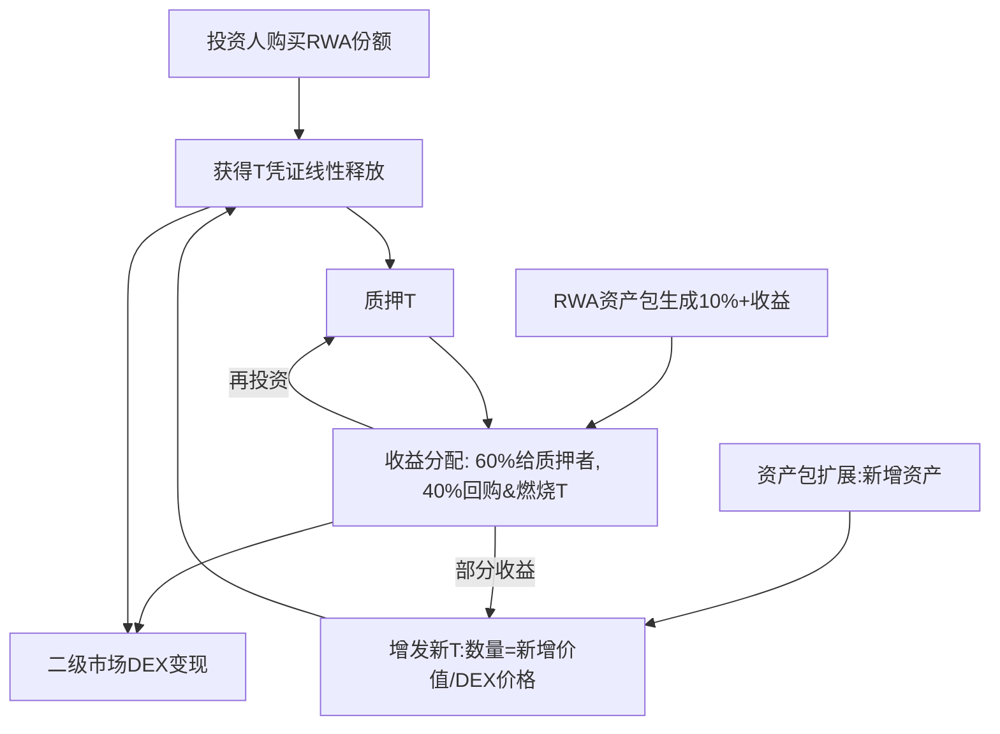
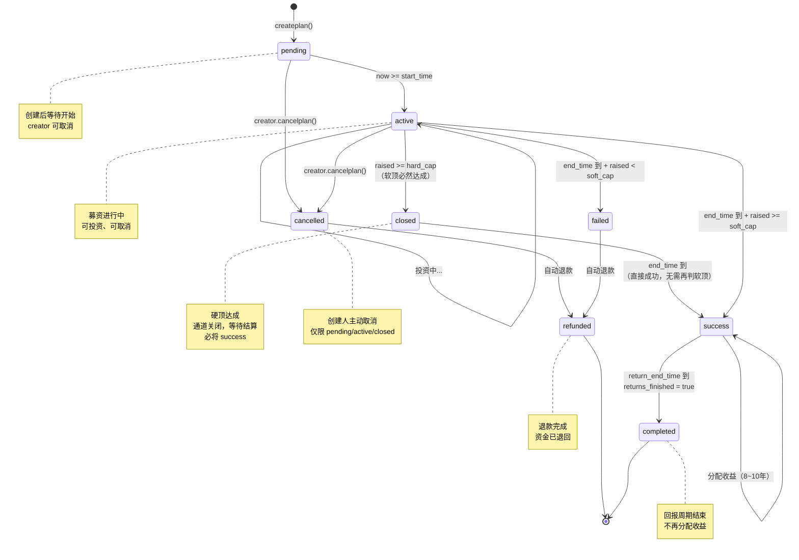
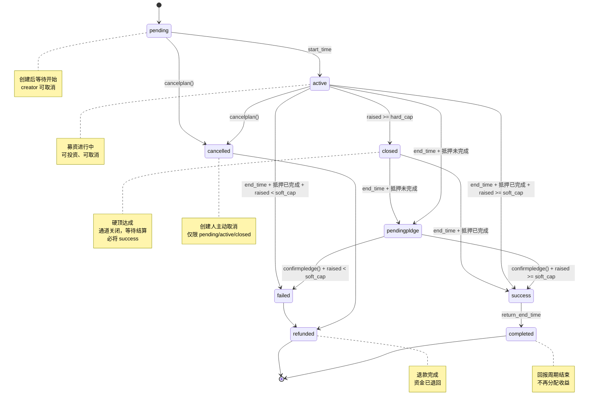

```mermaid
graph TD
    A[投资人购买RWA份额]
    B[获得T凭证线性释放]
    C[质押T]
    D[RWA资产包生成10%+收益]
    E[收益分配: 60%给质押者, 40%回购&燃烧T]
    F[二级市场DEX变现]
    G[资产包扩展:新增资产]
    H[增发新T:数量=新增价值/DEX价格]
    
    A --> B
    B --> C
    D --> E
    C --> E
    E -->|再投资| C
    E --> F
    B --> F
    G --> H
    H --> B
    E -->|部分收益| H
```

```mermaid
stateDiagram-v2
    [*] --> pending : createplan()

    %% 1. 启动阶段
    pending --> active : now >= start_time
    pending --> cancelled : creator.cancelplan()

    %% 2. 募资进行中
    active --> closed : raised >= hard_cap<br/>（软顶必然达成）
    active --> active : 投资中...
    active --> cancelled : creator.cancelplan()

    %% 3. 硬顶关闭（等待截止）
    closed --> success : end_time 到<br/>（直接成功，无需再判软顶）

    %% 4. 正常截止结算
    active --> success : end_time 到 + raised >= soft_cap
    active --> failed : end_time 到 + raised < soft_cap

    %% 5. 取消与失败 → 退款
    cancelled --> refunded : 自动退款
    failed --> refunded : 自动退款
    refunded --> [*]

    %% 6. 成功 → 回报 → 完结
    success --> completed : return_end_time 到<br/>returns_finished = true
    success --> success : 分配收益（8~10年）

    completed --> [*]

    %% 注释
    note right of pending
        创建后等待开始
        creator 可取消
    end note

    note right of active
        募资进行中
        可投资、可取消
    end note

    note right of closed
        硬顶达成
        通道关闭，等待结算
        必将 success
    end note

    note right of cancelled
        创建人主动取消
        仅限 pending/active/closed
    end note

    note right of refunded
        退款完成
        资金已退回
    end note

    note right of completed
        回报周期结束
        不再分配收益
    end note
```

```mermaid
stateDiagram-v2
    [*] --> pending

    pending --> active : start_time
    pending --> cancelled : cancelplan()

    active --> closed : raised >= hard_cap
    active --> cancelled : cancelplan()

    %% 募资结束 → 等待抵押
    closed --> pendingpldge : end_time + 抵押未完成
    closed --> success : end_time + 抵押已完成

    active --> pendingpldge : end_time + 抵押未完成
    active --> success : end_time + 抵押已完成 + raised >= soft_cap
    active --> failed : end_time + 抵押已完成 + raised < soft_cap

    %% 担保人抵押 → 最终结算
    pendingpldge --> success : confirmpledge() + raised >= soft_cap
    pendingpldge --> failed  : confirmpledge() + raised < soft_cap

    success --> completed : return_end_time
    failed --> refunded
    cancelled --> refunded
    refunded --> [*]
    completed --> [*]

 %% 注释
    note right of pending
        创建后等待开始
        creator 可取消
    end note

    note right of active
        募资进行中
        可投资、可取消
    end note

    note right of closed
        硬顶达成
        通道关闭，等待结算
        必将 success
    end note

    note right of cancelled
        创建人主动取消
        仅限 pending/active/closed
    end note

    note right of refunded
        退款完成
        资金已退回
    end note

    note right of completed
        回报周期结束
        不再分配收益
    end note
```

