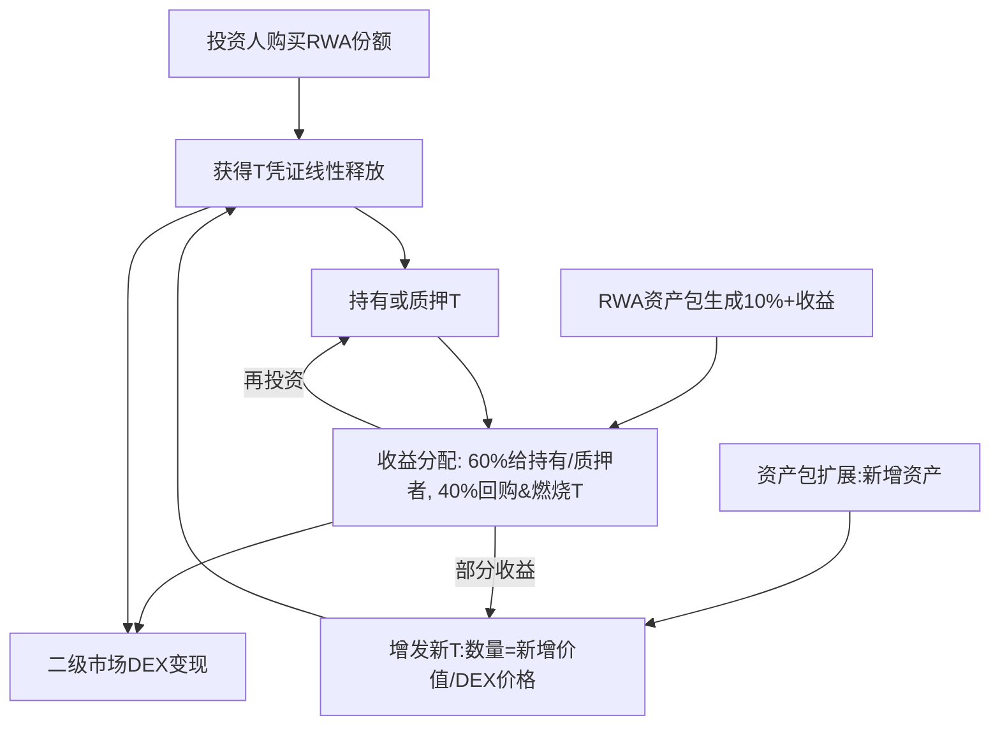

```mermaid
graph TD
    A[投资人购买RWA份额]
    B[获得T凭证线性释放]
    C[持有或质押T]
    D[RWA资产包生成10%+收益]
    E[收益分配: 60%给持有/质押者, 40%回购&燃烧T]
    F[二级市场DEX变现]
    G[资产包扩展:新增资产]
    H[增发新T:数量=新增价值/DEX价格]
    
    A --> B
    B --> C
    D --> E
    C --> E
    E -->|再投资| C
    E --> F
    B --> F
    G --> H
    H --> B
    E -->|部分收益| H
```
