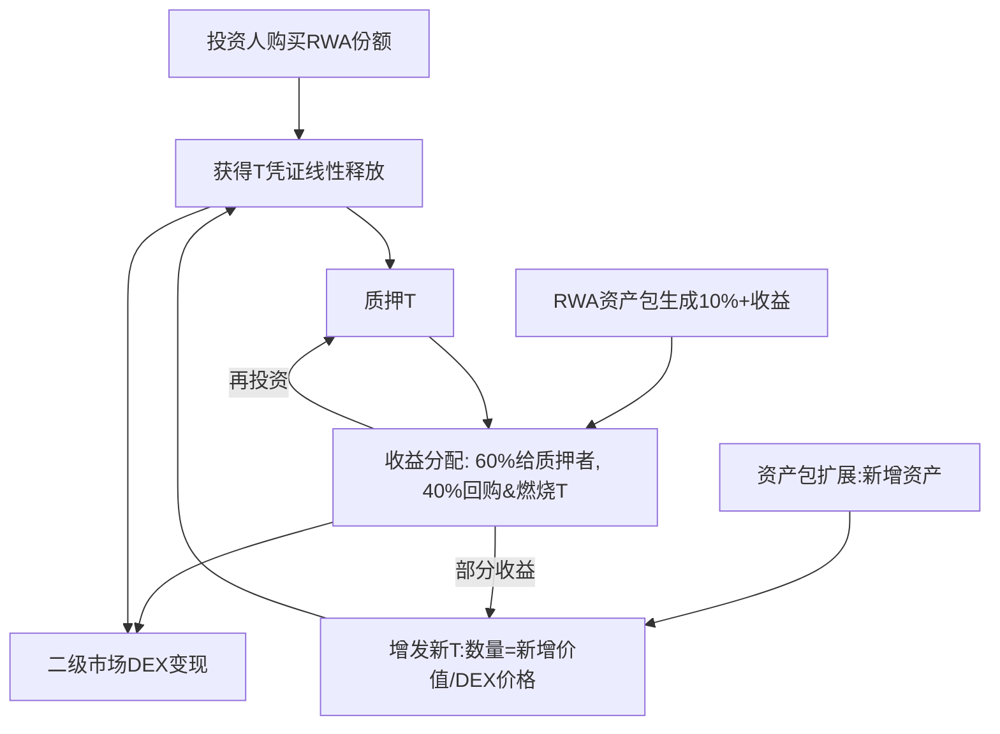
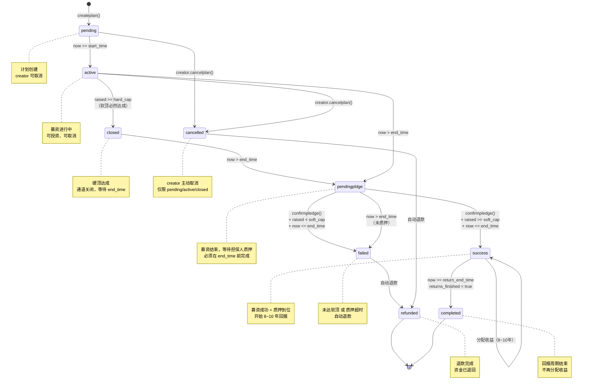

```mermaid
graph TD
    A[投资人购买RWA份额]
    B[获得T凭证线性释放]
    C[质押T]
    D[RWA资产包生成10%+收益]
    E[收益分配: 60%给质押者, 40%回购&燃烧T]
    F[二级市场DEX变现]
    G[资产包扩展:新增资产]
    H[增发新T:数量=新增价值/DEX价格]
    
    A --> B
    B --> C
    D --> E
    C --> E
    E -->|再投资| C
    E --> F
    B --> F
    G --> H
    H --> B
    E -->|部分收益| H
```

```mermaid
stateDiagram-v2
    [*] --> pending : createplan()

    %% 1. 启动阶段
    pending --> active : now >= start_time
    pending --> cancelled : creator.cancelplan()

    %% 2. 募资进行中
    active --> closed : raised >= hard_cap<br/>（软顶必然达成）
    active --> cancelled : creator.cancelplan()

    %% 3. 募资截止 → 进入 pendingpldge（等待质押）
    closed --> pendingpldge : now > end_time
    active --> pendingpldge : now > end_time

    %% 4. 质押处理（必须在 end_time 前）
    pendingpldge --> success : confirmpledge()<br/>+ raised >= soft_cap<br/>+ now <= end_time
    pendingpldge --> failed  : confirmpledge()<br/>+ raised < soft_cap<br/>+ now <= end_time

    %% 5. 质押超时 → 自动失败
    pendingpldge --> failed : now > end_time<br/>（未质押）

    %% 6. 成功 → 回报 → 完结
    success --> completed : now >= return_end_time<br/>returns_finished = true
    success --> success : 分配收益（8~10年）

    %% 7. 失败/取消 → 退款
    failed --> refunded : 自动退款
    cancelled --> refunded : 自动退款
    refunded --> [*]

    %% 8. 完结
    completed --> [*]

    %% 注释说明
    note right of pending
        计划创建
        creator 可取消
    end note

    note right of active
        募资进行中
        可投资、可取消
    end note

    note right of closed
        硬顶达成
        通道关闭，等待 end_time
    end note

    note right of pendingpldge
        募资结束，等待担保人质押
        必须在 end_time 前完成
    end note

    note right of success
        募资成功 + 质押到位
        开始 8~10 年回报
    end note

    note right of failed
        未达软顶 或 质押超时
        自动退款
    end note

    note right of cancelled
        creator 主动取消
        仅限 pending/active/closed
    end note

    note right of refunded
        退款完成
        资金已退回
    end note

    note right of completed
        回报周期结束
        不再分配收益
    end note
```

