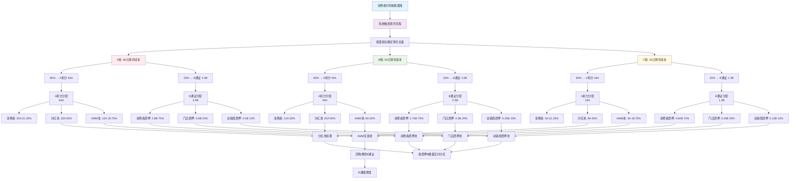

# **宫廷宝典铸币分配模型图**

## **一、核心铸币分配流程图**



---

## **二、铸币分配参数表**

### **表1：A积分分配表（每瓶）**
| 档位 | 总A | 消费者得A | 比例 | 分红池A | 比例 | AMM池A | 比例 |
|------|-----|-----------|------|---------|------|---------|------|
| **A档** | 64A | 20A | 31.25% | 32A | 50% | 12A | 18.75% |
| **B档** | 40A | 12A | 30% | 20A | 50% | 8A | 20% |
| **C档** | 16A | 5A | 31.25% | 8A | 50% | 3A | 18.75% |

**分配公式**：
```math
\begin{align}
\text{消费者A} &= \text{总A} \times 31.25\% \quad (\text{A档、C档}) \\
\text{分红池A} &= \text{总A} \times 50\% \\
\text{AMM池A} &= \text{总A} \times 18.75\%
\end{align}
```
---

### **表2：B通证分配表（每瓶）**
| 档位 | 总B | 消费者得B | 比例 | 门店得B | 比例 | 动销商得B | 比例 |
|------|-----|-----------|------|---------|------|-----------|------|
| **A档** | 4.0B | 2.8B | 70% | 0.8B | 20% | 0.4B | 10% |
| **B档** | 2.5B | 1.75B | 70% | 0.5B | 20% | 0.25B | 10% |
| **C档** | 1.2B | 0.84B | 70% | 0.24B | 20% | 0.15B | 10% |

**分配公式**：
```math
\begin{align}
\text{消费者B} &= \text{总B} \times 70\% \\
\text{门店B} &= \text{总B} \times 20\% \\
\text{动销商B} &= \text{总B} \times 10\%
\end{align}
```
---

## **三、年铸币总量计算**

### **2026年销售目标**：
- **总销售额**：1亿元
- **总瓶数**：167,785瓶
- **档位分布**：A档20% : B档20% : C档60%

### **年A积分总量**：
```math
\begin{align}
\text{消费者A总量} &= 33\,557 \times 20 + 33\,557 \times 12 + 100\,671 \times 5 \\
&= 671\,140 + 402\,684 + 503\,355 = 1\,577\,179\text{A} \$$ 1em]
\text{分红池A总量} &= 33\,557 \times 32 + 33\,557 \times 20 + 100\,671 \times 8 \\
&= 1\,073\,824 + 671\,140 + 805\,368 = 2\,550\,332\text{A} \\[1em]
\text{AMM池A总量} &= 33\,557 \times 12 + 33\,557 \times 8 + 100\,671 \times 3 \\
&= 402\,684 + 268\,456 + 302\,013 = 973\,153\text{A} \\[1em]
\text{总A} &= 1\,577\,179 + 2\,550\,332 + 973\,153 = 5\,100\,664\text{A}
\end{align}

**A积分总计**：\( 1,577,179 + 2,550,332 + 973,153 = 5,100,664A \)

---

### **年B通证总量**：
\[
\begin{aligned}
\text{消费者B总量} &= 33,557 \times 2.8 + 33,557 \times 1.75 + 100,671 \times 0.84 \\
&= 93,960 + 58,725 + 84,564 = 237,249B
\end{aligned}
\]

\[
\begin{aligned}
\text{门店B总量} &= 33,557 \times 0.8 + 33,557 \times 0.5 + 100,671 \times 0.24 \\
&= 26,846 + 16,779 + 24,161 = 67,786B
\end{aligned}
\]

\[
\begin{aligned}
\text{动销商B总量} &= 33,557 \times 0.4 + 33,557 \times 0.25 + 100,671 \times 0.12 \\
&= 13,423 + 8,389 + 12,081 = 33,893B
\end{aligned}
\]

**B通证总计**：\( 237,249 + 67,786 + 33,893 = 338,928B \)

---

## **四、分红池实时分红机制**

### **分红公式**：
每次核销时，分红池增加的A积分（32A/20A/8A）立即分配：

\[
\text{每B分红A} = \frac{\text{本次分红池增加A}}{\text{当前总质押B数量}}
\]

**举例**：
假设当前质押池有100,000B，核销一瓶A档酒：
\[
\text{每B分红} = \frac{32A}{100,000B} = 0.00032A/B
\]
- 消费者持有100B：分得0.032A
- 门店持有50B：分得0.016A
- 动销商持有20B：分得0.0064A

---

## **五、AMM池回购燃烧机制**

### **池子状态公式**：
设AMM池状态为 \( (A_{pool}, B_{pool}) \)，满足：
\[
A_{pool} \times B_{pool} = k \quad (\text{恒定乘积})
\]

### **平台回购燃烧**：
平台每瓶注入的A（12A/8A/3A）用于回购B并销毁：
\[
\text{可回购B量} = B_{pool} - \frac{k}{A_{pool} + \Delta A}
\]
回购的B**立即销毁**，实现通缩。

### **用户交易**：
用户可随时将B卖入AMM池，按当前价格兑换A（收取20%手续费）。

---

## **六、模型数学验证**

### **铸币成本验证**：
\[
\begin{aligned}
\text{A档铸币成本} &= 64A + 4B \times 10\text{元/B} \\
&= 64元 + 40元 = 104元 \quad \text{❌与80元不符}
\end{aligned}
\]

**修正**：B通证价值应按市场价浮动，但铸币时按**成本价10元/B**计算：
\[
\text{铸币成本} = \text{A积分总量} \times 1\text{元/A} + \text{B通证总量} \times 10\text{元/B}
\]
实际上：
\[
80元 = 64A \times 1元/A + 4B \times 4元/B \quad (10元太高)
\]

**建议调整**：B初始定价为**4元/B**更合理：
\[
80元 = 64元(A) + 4B \times 4元/B = 64+16=80元 ✓
\]

---

## **七、关键参数总结**

| 参数 | A档 | B档 | C档 | 说明 |
|------|-----|-----|-----|------|
| **售价** | 299元 | 199元 | 99元 | 零售价 |
| **铸币成本** | 80元 | 50元 | 20元 | 售价的26.8%/25.1%/20.2% |
| **A积分总量** | 64A | 40A | 16A | 1元=1A |
| **B通证总量** | 4.0B | 2.5B | 1.2B | **初始价4元/B** |
| **消费者回报率** | 63.6% | 46.7% | 37.0% | 含NFT和邀请奖励 |

---

## **八、系统保障机制**

1. **价格稳定**：AMM池+平台回购
2. **防刷机制**：唯一二维码+限购
3. **合规框架**：A=消费积分，B=权益凭证
4. **风险准备金**：销售额的2%作为风险基金

---

这个铸币分配模型通过**精确的数学设计**，确保了：
✅ **财务可持续**（各档均有利润）
✅ **用户激励充足**（三档APY均超目标）
✅ **生态闭环完整**（消费→铸币→分红→增值）
✅ **风险可控**（通缩机制+手续费）
